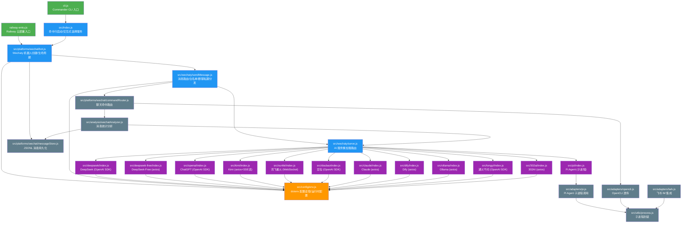

# wechat-bot 深度代码审查报告

> 审查日期：2026-07-06 | 仓库：`C:\Users\18034\wechat-bot` | 版本：1.0.2
>
> 代码统计：77 个文件，约 1,930 行 JavaScript 源码（不含 node_modules），37 个 JS 源文件分布于 src/ 下 14 个子目录。根目录有 railway-entry.js (18行)、cli.js (4行) 及非代码配置文件若干。

---

## 一、项目整体架构分析

### 1.1 架构概览

wechat-bot 是一个基于 **Wechaty + wechaty-puppet-wechat4u** 的微信个人号 AI 机器人。核心理念是"微信消息 → AI 服务 → 回复"，支持 12 种 AI 后端（DeepSeek、ChatGPT、Claude、Kimi、讯飞、豆包、Ollama、通义千问、Dify、302AI、Pi Agent 等）。采用 ESM 模块化设计（`"type": "module"`），命令行入口为 Commander 驱动的 `cli.js`，Railway 云端入口为 `railway-entry.js`。

### 1.2 模块依赖图（Mermaid）



### 1.3 数据流路径

```
微信消息 → Wechaty bot.on('message')
  ├── captureWechatMessage() → JSONL 持久化存储
  └── defaultMessage() → 白名单检查 → 消息前缀匹配
       ├── 命令前缀? → commandRouter() → 分析/OpenCLI
       └── 回复前缀? → getServe(type) → AI API 调用 → 回复
```

---

## 二、代码质量评估

### 2.1 安全漏洞 ⚠️ 高优先级

#### 2.1.1 API Key 通过 console.log 泄露（严重）

**影响文件**: `src/deepseek/index.js`, `src/openai/index.js`, `src/doubao/index.js`, `src/kimi/index.js`, `src/dify/index.js`, `src/deepseek-free/index.js`, `src/302ai/index.js`, `src/claude/index.js`

几乎所有 AI 服务模块都将完整的用户 prompt 和 AI 回复通过 `console.log` 打印，打印内容包含上下文但不包含 API Key。然而 `src/dify/index.js:31` 直接打印了包含 Authorization 头的 config 对象：

```javascript
console.log('🌸🌸🌸 / config: ', config) // 包含 Authorization: Bearer ${token}
```

这会将 API Key 明文写入日志。Railway 日志持久存储且可被项目成员查看，构成严重密钥泄露风险。

#### 2.1.2 .env 文件中的密钥无保护

`.gitignore` 中包含了 `.env`（但前有空格），实际读取时使用了 `dotenv.config().parsed`，但各服务模块在顶层作用域中多处使用 `dotenv.config().parsed`（重复调用），且所有 API Key 均以明文从环境变量读取，无加密、无密钥轮换机制。

#### 2.1.3 远程命令执行风险

`src/platforms/wechat/commandRouter.js` 中，通过微信聊天命令可以触发 `runOpenCli()`，虽然由 `ENABLE_REMOTE_OPENCLI` 开关保护（默认 false），但一旦开启，任何白名单内的微信用户都可以通过聊天消息控制宿主机执行任意命令。这是一种典型的 **CWE-94: 代码注入** 风险。

#### 2.1.4 硬编码 UID

`src/xunfei/xunfei.js:87` 中硬编码了 `uid: 'fd3f47e4-d'`，无实际随机性，多实例情况下会产生 User ID 冲突。

### 2.2 未处理异常 ⚠️ 中优先级

| 位置 | 问题 | 严重度 |
| --- | --- | --- |
| `src/deepseek/index.js:27-33` | `openai.chat.completions.create()` 无 try-catch，网络异常或 API 错误直接导致未捕获的 Promise rejection | 高 |
| `src/openai/index.js:28-34` | 同上 | 高 |
| `src/doubao/index.js:28-49` | 同上 | 高 |
| `src/tongyi/index.js:28-36` | 同上 | 高 |
| `src/wechaty/sendMessage.js:31-66` | catch 块仅 `console.error(e)`，错误被静默吞掉，无重试、无降级、无用户提示 | 中 |
| `src/kimi/index.js:87-93` | catch 中只打印错误信息，返回 undefined，导致 `sendMessage.js` 中将 undefined 传给 `say()` | 中 |
| `src/deepseek-free/index.js:39-48` | 同上 | 中 |
| `src/dify/index.js:28-38` | 同上 | 中 |
| `src/ollama/index.js:34-44` | 同上 | 中 |
| `src/claude/index.js:64-71` | 同上 | 中 |
| `src/302ai/index.js:31-40` | 同上 | 中 |
| `src/xunfei/xunfei.js:126-129` | WebSocket error 回调中 `reject('')` 返回空字符串，与 close 事件 `resolve(total_res)` 存在竞态条件 | 中 |
| `src/wechaty/bot.js:72` | `bot.start().catch()` 只打印错误，未尝试重连或重启 | 中 |

### 2.3 代码坏味 🟡 一般

#### 2.3.1 环境变量重复加载

至少 12 个模块独立调用 `dotenv.config()` / `dotenv.config().parsed`，包括：

- `src/config/env.js`
- `src/deepseek/index.js`
- `src/openai/index.js`
- `src/kimi/index.js`
- `src/doubao/index.js`
- `src/dify/index.js`
- `src/deepseek-free/index.js`
- `src/ollama/index.js`
- `src/tongyi/index.js`
- `src/claude/index.js`
- `src/302ai/index.js`
- `src/xunfei/xunfei.js`
- `src/xunfei/index.js`
- `src/wechaty/testMessage.js`

虽然 dotenv 幂等，但大量分散调用破坏了单一配置源原则。`src/config/env.js:3` 中的 `dotenvResult.parsed` 会被后续模块的 `dotenv.config()` 调用覆盖。

#### 2.3.2 AI 服务接口不统一

12 个 AI 服务使用 3 种不同的客户端库（OpenAI SDK / axios / WebSocket）和 2 种不同的 API Key 注入方式（`Authorization` header vs OpenAI 构造函数），且错误处理策略完全不统一：

| 服务                       | 客户端     | 错误处理    | 流式   |
| -------------------------- | ---------- | ----------- | ------ |
| ChatGPT/DeepSeek/豆包/通义 | OpenAI SDK | ❌ 无       | ❌     |
| Kimi                       | axios      | ⚠️ 有 catch | ✅ SSE |
| DeepSeek-Free              | axios      | ⚠️ 有 catch | ❌     |
| Claude                     | axios      | ⚠️ 有 catch | ❌     |
| 302AI                      | axios      | ⚠️ 有 catch | ❌     |
| Dify                       | axios      | ⚠️ 有 catch | ❌     |
| Ollama                     | axios      | ⚠️ 有 catch | ❌     |
| 讯飞星火                   | WebSocket  | ❌ 复杂竞态 | ❌     |
| Pi                         | 子进程     | ⚠️ 有       | ❌     |

#### 2.3.3 代码重复严重

`src/deepseek/index.js`、`src/openai/index.js`、`src/doubao/index.js` 三者的结构几乎完全一致（OpenAI SDK 封装 + env 检查 + `process.exit`），代码重复率 > 70%。

#### 2.3.4 sendMessage.js 逻辑复杂度过高

`src/wechaty/sendMessage.js` 的 `defaultMessage` 函数承担了过多职责：白名单检查、群聊/私聊路由、前缀匹配、命令分发、错误处理，全部耦合在一个 67 行的函数中。符合 **God Function** 坏味。

#### 2.3.5 魔法字符串遍布

`src/wechaty/serve.js` 的 switch-case 使用字符串字面量（`'ChatGPT'`、`'deepseek'` 等），与 `src/index.js` 中的 `serveList` 定义不一致，两个地方各维护一份枚举，容易出现拼写不一致。

#### 2.3.6 无用导入

`src/deepseek/index.js` 和 `src/openai/index.js` 和 `src/doubao/index.js` 中导入了 `remark` 和 `strip-markdown`，但从未使用。`src/doubao/index.js` 还导入了 `fs` 和 `path` 但只在 `.env` 检查时使用了 `path.resolve()`。

---

## 三、性能分析

### 3.1 瓶颈点

#### 3.1.1 同步文件 I/O 阻塞事件循环 🔴 高

`src/platforms/wechat/messageStore.js:45` 使用了 `fs.appendFileSync()` —— **同步写入**，每次收到微信消息都会同步写入磁盘。在高频群聊场景下，这直接阻塞 Node.js 事件循环，导致所有消息处理延迟累积。

```javascript
// 当前代码 (messageStore.js:45)
fs.appendFileSync(storePath, `${JSON.stringify(record)}\n`, 'utf8')
```

Wechaty 的消息处理是单线程异步模型，任何同步 I/O 都会阻塞后续消息。

#### 3.1.2 消息全量加载到内存

`src/platforms/wechat/messageStore.js:54-63` 的 `loadWechatMessages()` 函数一次性将整个 JSONL 文件读入内存：

```javascript
const lines = fs
  .readFileSync(storePath, 'utf8') // 同步读取全部
  .split('\n')
```

在长期运行后，JSONL 文件可能达到数百 MB，全量同步读取会导致严重的内存压力和主线程卡死。

#### 3.1.3 Kimi 流式响应未做超时控制

`src/kimi/index.js:60` 设置了 120 秒超时，但 SS E 流式解析 (`lines.forEach`) 中无超时保护，如果 Kimi 服务端挂起不断开连接，整个请求将挂起直到 TCP 超时。

#### 3.1.4 讯飞 WebSocket 无重连机制

`src/xunfei/xunfei.js:78` 每次调用创建新的 WebSocket 连接，无连接池、无重连逻辑。在高并发场景下会创建大量 WebSocket 连接。

#### 3.1.5 deepseek/index.js 缺少 connecton 复用

使用 OpenAI SDK 但未配置 HTTP Agent（keep-alive），每次请求都建立新的 TCP 连接。

### 3.2 内存泄漏风险

| 风险点                        | 描述                                                                                      | 严重度 |
| ----------------------------- | ----------------------------------------------------------------------------------------- | ------ |
| `src/xunfei/xunfei.js:78-133` | 如果 WebSocket 在 `open` 事件前抛出异常，Promise 永远不被 resolve/reject，socket 对象泄露 | 中     |
| `src/wechaty/sendMessage.js`  | 每次消息创建大量临时变量（contact、room、alias 等），在高频消息下 GC 压力大               | 低     |
| `src/platforms/wechat/bot.js` | 事件监听器未调用 `removeListener`，但 Wechaty 本身管理其生命周期，风险可控                | 低     |

---

## 四、Railway 部署适配评估

### 4.1 railway-entry.js 健壮性分析

```javascript
// railway-entry.js (18行)
process.on('uncaughtException', (err) => { /* 不退出 */ })
process.on('unhandledRejection', (reason, promise) => { console.error(...) })

async function main() {
  const { startWechatBot } = await import('./src/platforms/wechat/bot.js')
  console.log('Starting WeChat bot...')
  startWechatBot({ serviceType: process.env.SERVICE_TYPE || 'deepseek-free' })
}
main().catch((e) => { console.error('FATAL:', e.message); process.exit(1) })
```

#### ✅ 优点

1. **全局异常捕获**：`uncaughtException` 不自动退出，符合 Railway 的 24/7 稳定性需求
2. **Promise rejection 兜底**：捕获未处理的 rejection
3. **动态 import**：使用 `await import()` 允许 V8 在启动时优化
4. **环境变量 fallback**：`SERVICE_TYPE` 有默认值 `deepseek-free`

#### ❌ 问题

1. **uncaughtException 恢复过于乐观（严重）**：第 3-5 行的注释 `// Don't exit — let the bot try to recover` 是危险的假设。当原生 C++ 模块（如 `wechaty-puppet-wechat4u` 底层的 `wechat4u`）抛出 `uncaughtException` 时，Node.js 进程状态已不可靠。继续运行可能导致内存损坏或静默丢失消息。**这违反了 Node.js 官方最佳实践：uncaughtException 后应执行优雅关闭并重启**。

2. **无健康检查端点**：Railway 支持 `HEALTHCHECK` 指令，但 `railway-entry.js` 未暴露任何 HTTP 端口或健康检查机制。如果 Wechaty 内部 WebSocket 断开连接，进程仍存活但已无法收发消息。Railway 不会重启。

3. **无优雅关闭**：未监听 `SIGTERM`/`SIGINT`，Railway 重启时 Wechaty 连接被粗暴中断，可能导致微信协议层出现异常状态。

4. **railway.json 配置不足**：
   - `restartPolicyType: "ON_FAILURE"` 在进程无异常退出（exit code 0）时不会重启
   - `restartPolicyMaxRetries: 3` 后放弃，无外部告警机制

5. **Dockerfile 问题**：
   - `FROM node:19` 已于 2023 年 6 月 EOL，存在未修补安全漏洞
   - Dockerfile 中 `COPY *.js ./` 未包含 `patches/` 目录，可能导致 `patch-package` 在容器中找不到补丁文件
   - 未使用多阶段构建，镜像体积偏大

---

## 五、改进建议清单

### 🔴 高优先级（立即修复）

#### 1. 移除日志中的敏感信息泄漏

**位置**: `src/dify/index.js:31`

```diff
- console.log('🌸🌸🌸 / config: ', config)
+ console.log('🌸🌸🌸 / config: ', { ...config, headers: { ...config.headers, Authorization: '***' } })
```

#### 2. 统一 AI 服务错误处理 - 创建公共包装

**新建**: `src/services/baseService.js`

```javascript
// 统一的 AI 服务调用包装器
export async function callAIService(serviceName, requestFn, prompt) {
  try {
    console.log(`[${serviceName}] Request:`, prompt.slice(0, 100) + '...')
    const result = await requestFn(prompt)
    console.log(`[${serviceName}] Reply:`, String(result).slice(0, 100) + '...')
    return result
  } catch (error) {
    console.error(`[${serviceName}] Error:`, error.message)
    // 返回友好降级消息
    return `[${serviceName} 服务暂时不可用] 请稍后再试。错误：${error.message}`
  }
}
```

#### 3. 修复同步文件写入阻塞

**位置**: `src/platforms/wechat/messageStore.js:45`

```diff
- fs.appendFileSync(storePath, `${JSON.stringify(record)}\n`, 'utf8')
+ import { writeFile, appendFile } from 'fs/promises'
+ await appendFile(storePath, `${JSON.stringify(record)}\n`, 'utf8')
```

#### 4. 修复 railway-entry.js 的 uncaughtException 处理

```diff
process.on('uncaughtException', (err) => {
  console.error('UNCAUGHT EXCEPTION:', err.message, err.stack)
-  // Don't exit — let the bot try to recover
+  // 记录错误后优雅退出，让 Railway 重启
+  console.error('致命错误，进程即将退出以触发 Railway 重启...')
+  setTimeout(() => process.exit(1), 5000) // 给日志写入留时间
})

+ // 优雅关闭
+ process.on('SIGTERM', async () => {
+   console.log('收到 SIGTERM，正在优雅关闭...')
+   process.exit(0)
+ })
+ process.on('SIGINT', async () => {
+   console.log('收到 SIGINT，正在优雅关闭...')
+   process.exit(0)
+ })
```

### 🟡 中优先级（本周修复）

#### 5. 为 AI 服务模块添加超时和重试

**以 deepseek/index.js 为例**：

```diff
const openai = new OpenAI({
  apiKey: env.DEEPSEEK_API_KEY,
  baseURL: env.DEEPSEEK_URL,
+ timeout: 30000,
+ maxRetries: 2,
})
```

#### 6. 添加 loadWechatMessages 内存保护

```diff
export function loadWechatMessages(options = {}) {
  const storePath = getMessageStorePath(options.dataDir)
  if (!fs.existsSync(storePath)) return []
+ const stat = fs.statSync(storePath)
+ if (stat.size > 50 * 1024 * 1024) { // 超过 50MB 警告
+   console.warn('消息文件过大，仅读取尾部数据')
+ }
  // ... 后续逻辑
}
```

#### 7. 提取 sendMessage 的职责分离

将 `defaultMessage` 拆分为：

- `src/wechaty/messageRouter.js` — 消息分发逻辑
- `src/wechaty/whitelistChecker.js` — 白名单检查
- `src/wechaty/commandHandler.js` — 命令匹配与执行

#### 8. 升级 Dockerfile Node.js 版本

```diff
- FROM node:19 as builder-default
+ FROM node:22-alpine AS builder
```

### 🟢 低优先级（迭代优化）

#### 9. 统一配置加载为单例

`src/config/env.js` 应作为唯一配置入口，其他模块不再独立调用 `dotenv.config()`。

#### 10. 统一 AI 服务抽象接口

```javascript
// src/services/AIService.js
export class AIService {
  constructor(config) {
    this.config = config
  }
  async reply(prompt) {
    throw new Error('Not implemented')
  }
}
// 所有 AI 服务继承此类
```

#### 11. 使用常量枚举替代魔法字符串

```javascript
// src/constants.js
export const ServiceType = {
  CHATGPT: 'ChatGPT',
  DEEPSEEK: 'deepseek',
  KIMI: 'Kimi',
  // ...
}
```

#### 12. 添加健康检查端点

```javascript
// 在 railway-entry.js 中添加
import http from 'http'
http
  .createServer((req, res) => {
    res.writeHead(200, { 'Content-Type': 'application/json' })
    res.end(JSON.stringify({ status: 'ok', uptime: process.uptime() }))
  })
  .listen(process.env.PORT || 3000)
```

#### 13. 移除未使用的 import

- `src/deepseek/index.js`: 移除 `remark`, `strip-markdown`
- `src/openai/index.js`: 移除 `remark`, `strip-markdown`
- `src/doubao/index.js`: 移除 `remark`, `strip-markdown`, `fs`（仅在检查后不再需要）
- `src/tongyi/index.js`: 重复的 `dotenv.config()` 调用

---

## 总结

| 维度     | 评分     | 说明                                                |
| -------- | -------- | --------------------------------------------------- |
| 架构设计 | ⭐⭐⭐⭐ | 模块化清晰，懒加载设计好，多 AI 后端抽象合理        |
| 安全性   | ⭐⭐     | API Key 日志泄露、远程命令执行风险、密钥明文存储    |
| 可靠性   | ⭐⭐     | 异常处理不足，多个 API 调用无 try-catch，无重试机制 |
| 性能     | ⭐⭐⭐   | 同步 I/O 阻塞是主要瓶颈，消息存储可优化             |
| 可维护性 | ⭐⭐⭐   | 代码重复率较高，接口不统一，但目录结构清晰          |
| 部署适配 | ⭐⭐⭐   | Railway 基本适配，但缺少健康检查和优雅关闭          |

**整体评价**：该项目作为微信 AI 机器人的功能实现是完整的，多 AI 后端支持设计合理。但在**安全性、错误处理和生产环境健壮性**方面存在较大改进空间。建议优先修复 API Key 泄露和同步 I/O 阻塞问题，然后逐步统一 AI 服务接口、增强异常处理。

---

_报告生成时间：2026-07-06 | 工具：人工审查 + Python 代码统计脚本_
